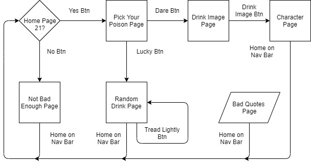
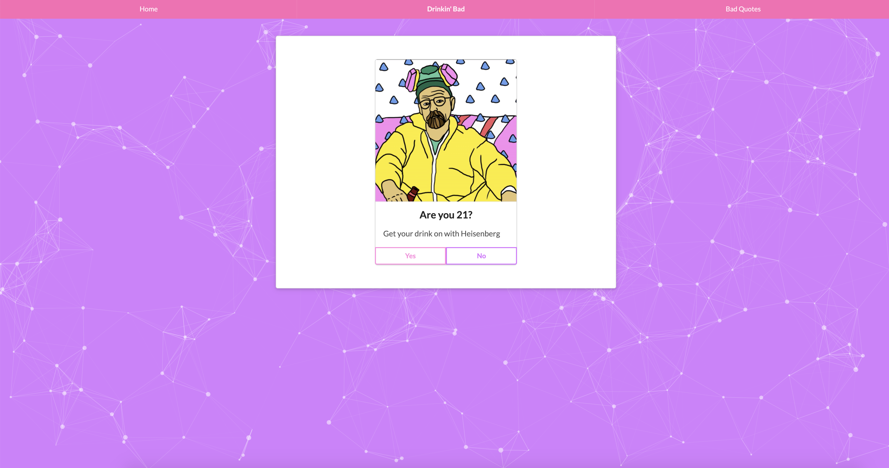
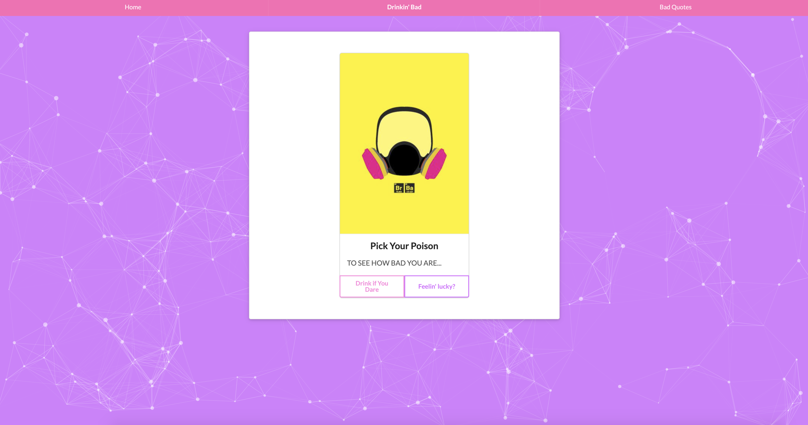
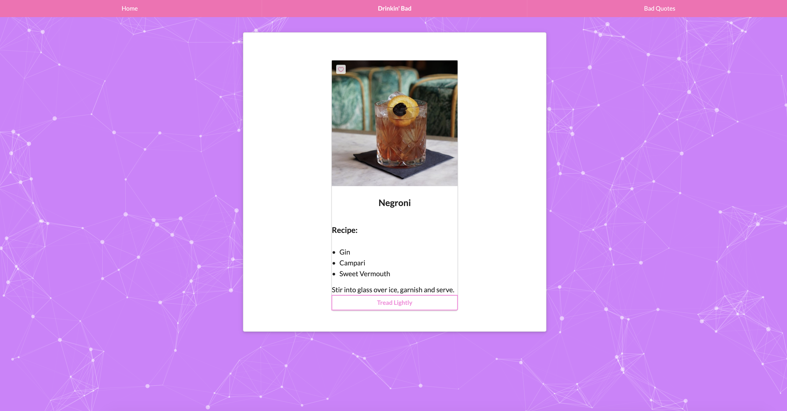
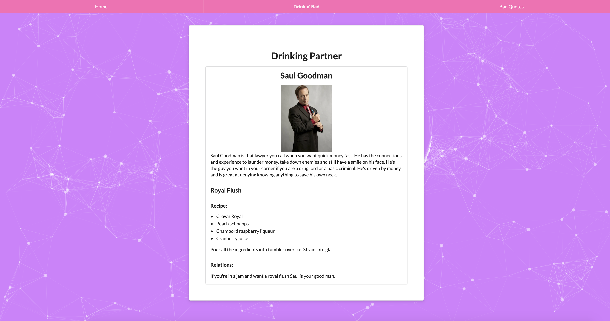
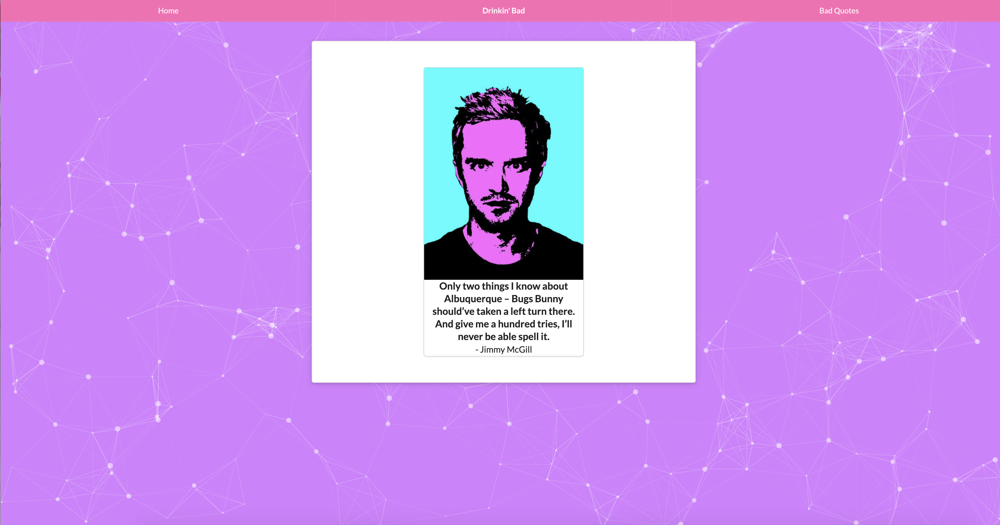

# Drinking Bad

## Project Description

This project is a simple application that can be expanded with later features. Inspired by the TV Drama "Breaking Bad" (BB), this application presents the user with a drink choice. Each drink choice leads to an information mashup page with BB character info, a drink selection, and the reason why that drink matches the character.

This responsive application has a foundation in HTML, CSS and Javascript. It utilizes a Semantic UI CSS framework and three separate APIs. The focus was on clean and simple code that would allow for easy expansion with new features as the project developed. 

## Deployment

  [Drinkin' Bad](https://hlsorrells.github.io/Drinking-Bad/)

  

## Table of Contents

  * [User Story](#user-story)
  * [Acceptance Criteria](#acceptance-criteria)
  * [Project Technology](#project-technology)
  * [Team Coordination](#team-coordination)
  * [Project Diagram](#project-diagram)
  * [Project Lessons](#project-lessons)
    * [The Drinking Partner For Loop](#the-drinking-partner-for-loop)
    * [Sticking to the Plan](#sticking-to-the-plan)
    * [Growing Pains as a Team](#growing-pains-as-a-team)
  * [Screenshots of Application](#screenshots-of-application)
  * [Contributing Authors](#contributing-authors)

----

  ## User Story

    ```
    AS AN avid fan of Breaking Bad tv show
    I WANT to get my favorite characters drink
    SO THAT I can see which character would be my drinking partner
    ```

  ## Acceptance Criteria

    ```
    GIVEN the user wants to try a new drink while watching the show
    WHEN the user clicks on the "Yes" button on the home page
    THEN the "Pick Your Poison" page appears
    WHEN the user clicks the "Feelin' lucky?" button
    THEN a random drink appears
    WHEN the user clicks on the "Tread Lightly" button
    THEN a new random drink is generated
    WHEN the user clicks the "Drink if You Dare" button
    THEN a grouping of drink buttons appear
    WHEN the user clicks on a drink button
    THEN a character mashup page is loaded
    WHEN the user clicks on the "No" button on the home page
    THEN a "Not Bad Enough" page loads
    WHEN the user clicks on the "Bad Quotes" button in the menu bar
    THEN a random quote from the BB show is generated
    WHEN the user clicks on the "Home" button in the menu bar
    THEN the home page is refreshed for the user to start over
    ```

----

## Project Technology
<details>
    <summary markdown="span">Click to expand Project Technology Details</summary>

Languages
- HTML
- CSS
- Javascript

Libraries
- jQuery
- Particle JS

CSS Framework
- [Semantic UI](semantic-ui.com)

APIs
- [The Cocktail DB](https://www.thecocktaildb.com/api.php)
- [Breaking Bad API](https://breakingbadapi.com/documentation)

</details>

## Team Coordination
Our team objective was to create a simple application that was entertaining to the user. As we began, we tried to divide the work in consideration of each members strengths and weaknesses. Lindsey and Samantha tackled selecting and learning the new CSS Framework for the project. Ashley and Heather were assigned to handle the Javascript and API tasks. To establish communication, we decided to perform daily stand-ups at least one per day and use Slack as an open communication channel between team members. To facilitate project task management, we chose to use the GitHub project tab's built in kanban feature to allow each member to freely create task items which could be claimed and tracked throughout the project.

## MVP - Minimum Viable Product
<details>
    <summary markdown="span">Click to expand MVP Details</summary>

The first step after deciding on a project idea was to determine what the MVP (Minimum Viable Product) criteria would be. These criteria would establish the completiion of the project. At that point, we could decide whether to pursue further improvements or features that would be placed in the "icebox" kanban column. The following details the MVP that meets the assignment's requirements.

Welcome page
- Asks the user whether or not they are 21
- Has an image topper
- Has a no button that trigger the "Too Bad" page
- Has a yes button that triggers the "Pick Your Poison" page

Too Bad Page
- Funny pic for image topper
- Text stating "Haha! You are not not bad enough"
- Home button to return to "Welcome" page
- Background set by particle.js

Pick Your Poison Page
- Buttons that trigger the "Character" page
- Each button will have an image of a drink
- Each button will lead to a specific BB character's page

Character Page
- Image of the BB character
- BB character name, nickname, and current status
- Actor(ess) that portrays the character
- Background set by particle.js
- Image of selected drink
- Ingredients list for the drink
- Instruction on how to mix the drink
</details>

## Project Diagram



*Diagram of user experience flow for Drinkin' Bad Project*

## Project Lessons

### The Drinking Partner For Loop
Properly coding the for loop needed to dynamically create the drink image buttons need to generate the character mashup page was a challenge for the group. We tried several different approaches, but finally discovered that we could not leave the AJAX call within the for loop as it was asynchronous. Once we moved the AJAX call into a separate function and called that function in the for loop, the drink buttons were assigned their proper data values to be passed on to the next function.

### Sticking to the Plan
During the course of this project, we learned the valuable lesson of creating (and sticking to) a detailed MVP plan. As we started making small "improvements" that deviated from the original plan, we encountered many unexpected challenges with using tag id's and working with the dynamic Javascript. Sometimes, we had to pull out part of the dynamic JS and put it inside a separate function as we learned more about how asynchronous coding in JS behaves. While the AJAX calls appeared simplistic, they become more and more complex as we began demanding more functionality from our site.

### Growing Pains as a Team
This was the first team project for each of us which meant that we all got a crash course on learning the ins and outs of working on a project using GitHub. We learned how to create and manage branches; we learned how to push a branch, create pull requests, and then merge the branch to master; we learned how to communicate through multiple channels from GitHub to Slack to stay on track and on time. All of these challenges has taught us to be better programmers through communication, determination, and perserverance.

## Screenshots of Application
<details>
    <summary markdown="span">Click to expand Screenshots of Application Details</summary>



*Screenshot of the home page*



*Screenshot of the Pick Your Poison page*



*Screenshot of the Random Drink page*



*Screenshot of the Character and Drink Mashup Page*



*Screenshot of the Random Quote page*
</details>

## Contributing Authors

[Ashley DeYoung](https://github.com/ashleydeyoung)

[Lindsey Lawson](https://github.com/lynseahoss)

[Samantha Morrison](https://github.com/sm-pixel)

[Heather Sorrells](https://github.com/Hlsorrells)
